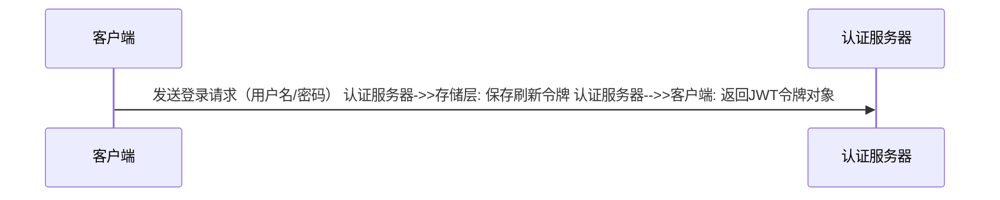
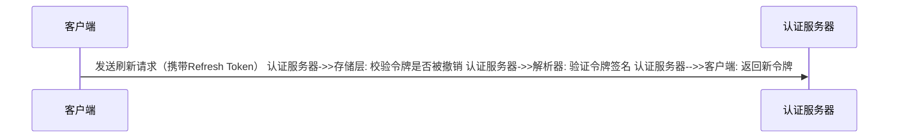
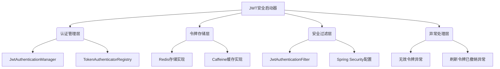

# JWT Security Spring Boot Starter

**版本要求**  Spring Boot 3.X | JDK 17+

一个集成Spring Security的JWT认证框架，省去了Spring Security繁琐的配置，开箱即用，为Spring Boot应用提供完善的令牌管理功能，包含刷新令牌撤销和访问令牌黑名单等核心安全特性。

---

## 核心特性

- **JWT认证**
  基于JSON Web Token实现无状态认证体系
- **双令牌架构**
  支持短时效访问令牌（Access Token）与长时效刷新令牌（Refresh Token）
- **安全增强**
    - 刷新令牌撤销机制
    - 访问令牌黑名单功能
    - 主体一致性校验
    - RSA256加密
- **存储抽象**
  支持Redis和Caffeine两种存储方案
- **Spring Security集成**
    - 自定义认证过滤器链
    - 线程安全上下文传播
    - 支持`@PermitAll`注解路径发现
- **灵活配置**
  通过配置文件实现全参数控制

---

## 快速开始

### 1. 添加依赖

#### Maven

```xml
<dependency>
    <groupId>com.github.tsukasahwan</groupId>
    <artifactId>jwt-security-spring-boot-starter</artifactId>
    <version>${version}</version>
</dependency>
```

#### Gradle

```groovy
implementation 'com.github.TsukasaHwan:jwt-security-spring-boot-starter:${version}'
```

### 2. 基础配置

在`application.yml`中添加JWT安全配置：

```yaml
jwt:
  security:
    # 请求头名称
    header: Authorization
    # 请求头前缀
    token-prefix: Bearer
    # 访问令牌过期时间
    expires-in: 30m
    # 刷新令牌过期时间
    refresh-token-expires-in: 15d
    # 指定刷新token的请求路径
    # refresh-token-path:
    # 采用@RefreshTokenApi注解形式指定刷新令牌的请求路径（设置为true时，refresh-token-path失效并且只能指定一个刷新路径）
    enabled-refresh-token-api-annotation: true
    # RSA256密钥文件路径
    secret:
      public-key: classpath:app.pub
      private-key: classpath:app.key
```

### 3. 启用安全配置

在Spring Boot主类添加`@EnableJwtSecurity`注解：

```java
@EnableJwtSecurity
@SpringBootApplication
public class SecurityDemoApplication {

    public static void main(String[] args) {
        SpringApplication.run(SecurityDemoApplication.class, args);
    }
}
```

### 4. 使用JWT认证

#### 使用示例

1. ##### 实现UserDetailsService

   ```java
   @Slf4j
   @Service
   @RequiredArgsConstructor
   public class UserDetailServiceImpl implements UserDetailsService {
   
       private final Map<String, User> userMap = Map.of("admin", new User());
   
       @Override
       public UserDetails loadUserByUsername(String username) throws UsernameNotFoundException {
           // 模拟从数据库查询
           return userMap.get(username);
       }
   
       public static class User implements UserDetails {
   
           @Override
           public Collection<? extends GrantedAuthority> getAuthorities() {
               Set<SimpleGrantedAuthority> authorities = new HashSet<>(2);
               SimpleGrantedAuthority roleAdmin = new SimpleGrantedAuthority("ROLE_ADMIN");
               SimpleGrantedAuthority simpleGrantedAuthority = new SimpleGrantedAuthority("USER:DEL");
               authorities.add(roleAdmin);
               authorities.add(simpleGrantedAuthority);
               return authorities;
           }
   
           @Override
           public String getPassword() {
               return "$2a$10$42BbssDi/Ab916u1HuU.8uzp9AWW4AiW.Y0jOGHYKCJ3qVsUUv6Vm";
           }
   
           @Override
           public String getUsername() {
               return "admin";
           }
   
           @Override
           public boolean isAccountNonExpired() {
               return true;
           }
   
           @Override
           public boolean isAccountNonLocked() {
               return true;
           }
   
           @Override
           public boolean isCredentialsNonExpired() {
               return true;
           }
   
           @Override
           public boolean isEnabled() {
               return true;
           }
       }
   }
   ```

2. ##### 实现认证失败处理类

   ```java
   /**
    * 可自定义消息返回
    */
   @Component
   public class JwtAuthenticationEntryPoint implements AuthenticationEntryPoint {
   
       @Override
       public void commence(HttpServletRequest request, HttpServletResponse response, AuthenticationException authException) throws IOException, ServletException {
           if (authException instanceof UsernameNotFoundException) {
               // 用户不存在
               WebUtils.renderJson(response, Result.of(HttpServletResponse.SC_UNAUTHORIZED, "用户名或密码错误"));
           } else if (authException instanceof BadCredentialsException) {
               // 用户名或密码错误
               WebUtils.renderJson(response, Result.of(HttpServletResponse.SC_UNAUTHORIZED, "用户名或密码错误"));
           } else if (authException instanceof InvalidTokenException) {
               // 无效的token
               WebUtils.renderJson(response, Result.of(HttpServletResponse.SC_UNAUTHORIZED, "无效令牌"));
           } else if (authException instanceof AccessTokenBlacklistedException) {
               // 访问令牌已列入黑名单
               WebUtils.renderJson(response, Result.of(HttpServletResponse.SC_UNAUTHORIZED, "访问令牌已列入黑名单"));
           } else if (authException instanceof RefreshTokenRevokedException) {
               // 刷新令牌已撤销
               WebUtils.renderJson(response, Result.of(HttpServletResponse.SC_UNAUTHORIZED, "刷新令牌已撤销"));
           } else if (authException instanceof ExpiredJwtAuthenticationException) {
               // 令牌已过期
               WebUtils.renderJson(response, Result.of(HttpServletResponse.SC_UNAUTHORIZED, "token已过期，请重新登录"));
           } else {
               // 其他异常
               WebUtils.renderJson(response, Result.of(HttpServletResponse.SC_UNAUTHORIZED, "认证失败"));
           }
       }
   }
   ```

3. ##### 实现访问被拒处理类

   ```java
   /**
    * 可自定义消息响应
    */
   @Component
   public class JwtAccessDeniedHandler implements AccessDeniedHandler {
   
       @Override
       public void handle(HttpServletRequest request, HttpServletResponse response, AccessDeniedException accessDeniedException) throws IOException, ServletException {
           // 权限不足
           WebUtils.renderJson(response, Result.of(HttpServletResponse.SC_FORBIDDEN, "权限不足，无权操作"));
       }
   }
   ```

4. ##### 登录示例

   ```java
   @Slf4j
   @RestController
   @RequiredArgsConstructor
   public class DemoController {
   
       private final AuthenticationManager authenticationManager;
   
       private final JwtAuthenticationManager jwtAuthenticationManager;
   
       @PermitAll
       @GetMapping("/users/login")
       public ResponseEntity<Jwt> login(@RequestParam String username,
                                        @RequestParam String password) {
           UsernamePasswordAuthenticationToken authenticationToken = new UsernamePasswordAuthenticationToken(username, password);
           authenticationManager.authenticate(authenticationToken);
           Jwt jwt = jwtAuthenticationManager.login(username);
           return ResponseEntity.ok(jwt);
       }
   }
   ```

#### 受保护接口

```java
@Slf4j
@RestController
@RequiredArgsConstructor
public class DemoController {

    @GetMapping("/users/test")
    @PreAuthorize("hasRole('ROLE_ADMIN')")
    public ResponseEntity<Void> test() {
        UserDetailServiceImpl.User principal = (UserDetailServiceImpl.User) SecurityContextHolder.getContext().getAuthentication().getPrincipal();
        log.info("{} 访问成功", principal.getUsername());
        return ResponseEntity.ok().build();
    }
}
```


---

## 核心组件

### 核心接口
| 接口名称                      | 功能说明                          |
| ----------------------------- | --------------------------------- |
| `JwtAuthenticationManager`    | JWT核心认证操作（登录/刷新/登出） |
| `AccessTokenBlacklistManager` | 访问令牌黑名单管理                |
| `RefreshTokenRevokeManager`   | 刷新令牌撤销管理                  |
| `TokenAuthenticatorRegistry`  | 令牌类型识别认证器注册            |

### 存储实现
| 存储类型 | 对应类                                                       | 配置项                   |
| -------- | ------------------------------------------------------------ | ------------------------ |
| Redis    | `RedisAccessTokenBlacklistManager`, `RedisRefreshTokenRevokeManager` | `storage-type: redis`    |
| Caffeine | `CaffeineAccessTokenBlacklistManager`, `CaffeineRefreshTokenRevokeManager` | `storage-type: caffeine` |

---

## 高级配置

### 自定义存储方案
使用Redis或Caffeine缓存：

```yaml
jwt:
  security:
    token-security:
      enabled: true
      refresh-token-revoke:
        enabled: true
        key-prefix: 'jwt:refresh_token:'
      access-token-blacklist:
        enabled: true
        key-prefix: 'jwt:access_token:blacklist:'
      # redis 或 Caffeine
      storage-type: redis
```

### 配置刷新令牌端点
通过`@RefreshTokenApi`注解指定刷新端点：

```java
@Autowired
private JwtAuthenticationManager jwtAuthenticationManager;

// 刷新接口
@RefreshTokenApi
@GetMapping("/users/refresh-token")
public Jwt refreshToken() {
    String refreshToken = JwtUtils.getTokenValue();
    UserDetailServiceImpl.User principal = (UserDetailServiceImpl.User) SecurityContextHolder.getContext().getAuthentication().getPrincipal();
    return jwtAuthenticationManager.refresh(principal.getUsername(), refreshToken);
}
```

### 启用安全特性

```yaml
jwt:
  security:
    token-security:
      enabled: true
      refresh-token-revoke:
        enabled: true
        key-prefix: 'jwt:refresh_token:'
      access-token-blacklist:
        enabled: true
        key-prefix: 'jwt:access_token:blacklist:'
      # 支持redis和caffeine（默认使用redis，如需使用caffeine请自行引入caffeine类库）
      storage-type: redis
```

---

## API参考

### 认证管理器

``` java
public interface JwtAuthenticationManager {

    /**
     * 登录
     *
     * @param subject 主体（通常为用户名）
     * @return {@link Jwt}
     */
    Jwt login(String subject);

    /**
     * 登录
     *
     * @param accessToken  {@link AccessToken}
     * @param refreshToken {@link RefreshToken}
     * @return {@link Jwt}
     */
    Jwt login(AccessToken accessToken, RefreshToken refreshToken);

    /**
     * 刷新
     *
     * @param subject           主体（通常为用户名）
     * @param refreshTokenValue 刷新令牌值
     * @return {@link Jwt}
     */
    Jwt refresh(String subject, String refreshTokenValue);

    /**
     * 刷新
     *
     * @param accessToken       访问令牌
     * @param refreshToken      刷新令牌
     * @param refreshTokenValue 刷新令牌值
     * @return {@link Jwt}
     */
    Jwt refresh(AccessToken accessToken, RefreshToken refreshToken, String refreshTokenValue);

    /**
     * 注销
     *
     * @param subject          主体（通常为用户名）
     * @param accessTokenValue 访问令牌值
     */
    void logout(String subject, String accessTokenValue);
}
```

### 安全配置项

```yaml
jwt:
  security:
    # 基础配置
    header: Authorization # 请求头名称 
    token-prefix: Bearer # 令牌前缀 
    expires-in: 30m # 访问令牌有效期
    refresh-token-expires-in: 15d  # 刷新令牌过期时间
    # 安全特性配置
    token-security:
      enabled: true # 是否启用令牌安全
      refresh-token-revoke:
        enabled: true # 刷新令牌是否启用注销功能
        key-prefix: 'jwt:refresh_token:' # 刷新令牌存储前缀
      access-token-blacklist:
        enabled: true # 访问令牌是否启用黑名单
        key-prefix: 'jwt:access_token:blacklist:' # 黑名单存储前缀
      storage-type: redis
```


---

## 使用场景

### 登录流程示意图



### 令牌刷新流程



---

## 最佳实践

1. **密钥生成**  
   使用OpenSSL生成RSA密钥对：

   ```bash
   openssl genpkey -algorithm RSA -out app.key -pkeyopt rsa_keygen_bits:2048
   openssl rsa -in app.key -pubout -out app.pub
   ```

   使用RSAUtil生成RSA密钥对：

   ```java
   public static void main(String[] args) throws IOException {
       String projectRoot = System.getProperty("user.dir");
       String resourcesPath = projectRoot + "/src/main/resources";
       RSAUtils.create(2048).genKeyPair(resourcesPath);
   }
   ```

2. **生产配置建议**

   ```yaml
   jwt:
     security:
       # 允许1分钟时钟偏差
       allowed-clock-skew: 1m
       token-security:
         enabled: true
         refresh-token-revoke:
           enabled: true
         access-token-blacklist:
           enabled: true
   ```

   

3. **CORS配置示例**

   ```java
   @Bean
   public UrlBasedCorsConfigurationSource corsConfigurationSource() {
       CorsConfiguration config = new CorsConfiguration();
       config.addAllowedOriginPattern(CorsConfiguration.ALL);
       return new UrlBasedCorsConfigurationSource("/**", config);
   }
   ```

   

---

## 常见问题

**Q: 如何生成RSA密钥对？**  
A: 使用OpenSSL命令生成2048位密钥：

```bash
openssl genpkey -algorithm RSA -out app.key -pkeyopt rsa_keygen_bits:2048
openssl rsa -in app.key -pubout -out app.pub
```

A:使用内置RSAUtil生成：

```java
public static void main(String[] args) throws IOException {
    String projectRoot = System.getProperty("user.dir");
    String resourcesPath = projectRoot + "/src/main/resources";
    RSAUtils.create(2048).genKeyPair(resourcesPath);
}
```

**Q: 如何自定义令牌有效期？**  
A: 在配置文件中设置：

```yaml
jwt.security.expires-in: 1h # 访问令牌1小时 
jwt.security.refresh-token-expires-in: 7d # 刷新令牌7天
```

**Q: 如何实现令牌刷新？**  
A: 使用认证管理器的刷新方法：

```java
Jwt newTokens = jwtAuthenticationManager.refresh(currentUser.getUsername(), refreshTokenValue);
```

---

### 架构概览



---

如需补充或调整内容请随时告知！